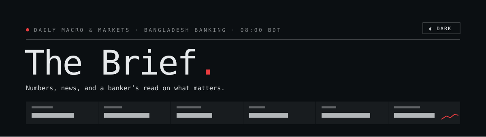

**Daily macro & markets read for Bangladesh banking professionals.**

[](https://thebrief.clauding-lab.com/)
[](#cadence)
[](./CHANGELOG.md)

Numbers, news, and a banker's read on what matters. One brief. Every morning at 08:00 BDT. ~15 minutes.

**Read it →** [thebrief.clauding-lab.com](https://thebrief.clauding-lab.com/)
**Subscribe (free) →** [thebrief.clauding-lab.com/#subscribe](https://thebrief.clauding-lab.com/#subscribe)

---

## What it is

The Brief is a daily editorial brief that synthesises Bangladesh's macro and markets data into a single ~15-minute read for senior banking professionals — business heads across corporate, SME, and retail, plus risk heads, plus treasury heads, at Tier-1 banks in Bangladesh.

Every morning at 08:00 BDT, a Python pipeline pulls fresh data from EconDelta (the upstream scraper system) via a Supabase store, hands it to Claude (Anthropic's LLM) running with a tightly-scoped Desk Editor prompt, and publishes the finished brief — structured prose + verdicts + numbers + headlines + chart data — back to Supabase. A Next.js single-page app on Vercel reads the latest issue and renders it as a cream-paper newspaper. Subscribers receive an HTML + plain-text email at the same moment via Brevo.

There is no human in the loop on the daily run. The brief writes itself, validates itself (via a subeditor LLM pass), and ships itself. The voice is consistent because the prompts are fixed; the data is fresh because the upstream scrapers finish about five hours earlier.

## Who it's for

Senior banking professionals at Tier-1 banks of Bangladesh who need:
- A defensible morning read on the **macro arc** — Bangladesh Bank policy, FX, sovereign debt, fiscal pressure
- Honest framing of the **markets day** — rates curve, DSEX, T-bills / T-bonds, gold, Brent
- A weekly **wrap on Friday** that synthesises the 5-day arc and flags next week's calendar items
- A single source that doesn't pretend daily volatility is a trend

The brief assumes the reader already knows what NPL means, what CAR is, and how to read a yield curve. It does not explain finance basics. It does explain what the numbers imply for desk positioning.

## What's in each issue

Each daily brief contains, in order:

| Block | What it is |
|---|---|
| **Masthead** | Issue number, date, "Today's Call" — the editorial thesis |
| **Snapshot strip** | 6 KPIs (USD/BDT, DSEX, 91-d T-Bill, Brent, Gold, March remittance) with sparklines |
| **Cover metric** | The single number that defines today's frame |
| **Banking** | NPL, CAR, defaulted-loan stock, sector credit growth |
| **Markets** | Rates curve, DSEX, FX flows, T-bill / T-bond yields |
| **Real Economy** | Macro indicators, BB monetary, fiscal items |
| **Policy** | NBR, regulatory, budget, IMF items |
| **Banker's read** | 2-3 sentences per major section: stance, watch list, risk vectors |

On Friday, the cadence shifts — Friday issues are **weekly wraps**: a 5-day synthesis with a "biggest movers" paragraph and a watch list for the next week.

## Cadence

| Day | Fires at | Type | Lens |
|---|---|---|---|
| Mon | 08:00 BDT | Daily | data-driven (FX-runway / credit-cycle / rates-curve / sovereign-debt / external-shock) |
| Tue | 08:00 BDT | Daily | data-driven |
| Wed | 08:00 BDT | Daily | data-driven |
| Thu | 08:00 BDT | Daily | data-driven |
| Fri | 08:00 BDT | **Weekly wrap** | 5-day synthesis |
| Sat | 08:00 BDT | Daily | data-driven |
| Sun | 08:00 BDT | Daily | data-driven |

Brief.timer on Hetzner runs `Mon..Sun 02:00 UTC` — every day, Saturday included.

## How it works

```text
┌─────────────────────┐        ┌───────────────────────┐        ┌──────────────────────┐
│  EconDelta scrapers │        │  Supabase             │        │  The Brief           │
│  (ExonVPS)          │  ────▶ │  metric_history,      │ ────▶  │  pipeline (Hetzner)  │
│  aggregate 02:55 BDT│        │  briefs, sections,    │        │  fires 08:00 BDT     │
│  daily              │        │  news, subscribers    │        │                      │
└─────────────────────┘        └───────────────────────┘        └──────────┬───────────┘
                                          │                                │
                                          │                                │ writes brief
                                          │                                ▼
                               ┌──────────┴───────────┐         ┌──────────────────────┐
                               │  Next.js SPA         │         │  Brevo               │
                               │  (Vercel)            │ ◀────── │  email API           │
                               │  reads briefs        │         │  sends to all rows   │
                               │  via RPC             │         │  in subscribers      │
                               └──────────────────────┘         └──────────────────────┘
```

### Four moving parts

1. **EconDelta scrapers** — separate repo (`clauding-lab/econdelta`), runs on ExonVPS. Fetches from ~01:30 BDT and finishes writing to Supabase `metric_history` when its aggregate stage lands at ~02:55 BDT — deliberately ahead of this pipeline's 08:00 fire, so a brief reads the SAME morning's data rather than yesterday afternoon's.
2. **The Brief pipeline** — Python, runs on Hetzner via `brief.service` systemd unit. Fires at 08:00 BDT. Six stages:
   1. **Gather** — per-section builders pull from `metric_history` (Supabase) and `latest.json` (rsync'd snapshot from ExonVPS)
   2. **Pick lens** — data-driven (NPL stress → credit-cycle; Brent spike → external-shock; etc.) or weekly_wrap on Friday
   3. **Editor LLM** — Claude with `editor_v6.txt` / `editor_v6_friday.txt` produces structured JSON (Today's Call, section verdicts, banker_read blocks, hero selection, etc.)
   4. **Subeditor LLM** — second Claude call validates the editor's output against the Pydantic schema + editorial rules; a malformed or incomplete review is retried once, then HOLDS the publish rather than shipping unreviewed
   5. **Publish** — `v6_publisher.publish_brief()` clears any same-issue row, then writes the brief as a `draft`, POSTs sections/metrics/news/chart_series, and flips `status='published'` as the LAST call — a two-phase write, not a single DELETE + INSERT (idempotent for same-day re-runs). A reconciliation pass force-reinserts a short list of protected metrics (currently the BB policy corridor) if the editor dropped them, and hard-fails the publish if one is still missing
   6. **Notify** — `notifier.notify()` fetches all rows from `subscribers`, renders an HTML + plain-text digest, and POSTs ONE Brevo call per subscriber (never a multi-recipient `to:` list — that would leak every recipient's address to the others). Fail-open — never crashes the publish.
3. **Supabase** — the data layer. Tables: `metric_history` (indicator time series), `briefs`, `sections`, `metrics`, `news`, `chart_series`, `chart_notes`, `subscribers`. Service-role auth for the publisher and the subscribe form; anon read-only auth for the SPA.
4. **Next.js SPA** — `app/`, deployed on Vercel. Reads the latest brief via the `get_latest_brief` Supabase RPC, renders it as a cream-paper newspaper. Hash-routed scroll-spy navigation, IntersectionObserver-driven sticky bar, no-JS-needed first paint via SSR.

## Tech stack

| Layer | Tool |
|---|---|
| Editorial pipeline | Python 3.11+ (stdlib + `anthropic` + `pydantic`) |
| LLM | Anthropic Claude (single model pin: Opus 4.8 via Claude CLI — no Sonnet path) |
| Data layer | Supabase Postgres + PostgREST |
| Web app | Next.js 16 (App Router) + React 19 + TypeScript |
| Charts | Chart.js 4 + `chartjs-adapter-date-fns` |
| Hosting (compute) | Hetzner (`clauding-lab`, Ubuntu, systemd) |
| Hosting (web) | Vercel |
| Email | Brevo (transactional API, one POST per subscriber) |
| Scrapers (upstream) | `clauding-lab/econdelta` on ExonVPS |

## Subscribe / unsubscribe

**Subscribe:** [thebrief.clauding-lab.com/#subscribe](https://thebrief.clauding-lab.com/#subscribe) — name, organisation, email, one click. No tracking. No marketing list.

**Unsubscribe:** reply to any brief email with "Unsubscribe" in the subject. (One-click automation is on the roadmap; manual reply works today.)

## Repo layout

```
the-brief/
├── app/                          # Next.js App Router — the SPA
│   ├── layout.tsx                # Root layout, metadata, PWA config
│   ├── page.tsx                  # Server-side initial fetch via Supabase RPC
│   ├── components/               # React components (Masthead, Section, Cover, SecNav, …)
│   └── globals.css               # Cream-paper design tokens + utility classes
├── brief/                        # Python pipeline
│   ├── cli.py                    # Entry: `python -m brief.cli run --publish`
│   ├── pipeline.py               # Section-gather orchestration
│   ├── pipeline_v6.py            # V6 publish flow (editor + subeditor + retries)
│   ├── v6_publisher.py           # PostgREST writer
│   ├── v6_schema.py              # Pydantic schema for the editor's JSON output
│   ├── notifier.py               # Release email notifier (Brevo)
│   ├── builders/                 # Per-section data gatherers
│   ├── claude/prompts/           # Editor + subeditor LLM prompts
│   ├── headlines.py              # News scraper
│   └── history.py                # PostgREST history client
├── lib/                          # Shared SPA helpers (format, fallback, supabase client)
├── deploy/                       # systemd unit, env example, install/uninstall scripts
│   ├── brief.service             # The daily (Mon–Sun) timer-driven oneshot unit
│   ├── brief.timer               # OnCalendar=Mon..Sun 02:00 UTC
│   └── brief.env.example         # Required env vars
├── docs/                         # Design docs, plans, ops notes
│   └── superpowers/specs/        # Per-feature design specs
├── tests/                        # pytest suite (~480 tests as of v1.0.0)
├── migrations/                   # SQL migrations against Supabase
├── public/                       # Static assets
├── CHANGELOG.md                  # Release history
└── README.md                     # This file
```

## Local development

### Python pipeline

```bash
# 1. Clone + create venv
git clone https://github.com/clauding-lab/the-brief.git
cd the-brief
python3 -m venv .venv
.venv/bin/pip install -r requirements.txt -r requirements-dev.txt

# 2. Provide env vars (the project's /etc/brief.env on Hetzner is the canonical source)
cp deploy/brief.env.example /tmp/brief.env
# Fill in SUPABASE_URL, SUPABASE_SERVICE_ROLE_KEY, BREVO_API_KEY, FROM_EMAIL, …

# 3. Run pytest
.venv/bin/pytest -q

# 4. Run the pipeline locally (dry-run = no Supabase write)
set -a && source /tmp/brief.env && set +a
.venv/bin/python -m brief.cli run --publish --dry-run --no-notify
```

CLI flags:
- `--publish` — V6 publish flow (writes to Supabase)
- `--dry-run` — go through the pipeline but skip the Supabase write
- `--no-notify` — skip the subscriber email after a successful publish
- `--today=YYYY-MM-DD` — override the date (useful for re-runs)
- `--write-fixture=<path>` — (with `--dry-run`) write the finished brief as JSON instead of publishing; no Supabase write, no email
- `--preview-notify` — (with `--write-fixture`) best-effort ping to Discord + email with the preview link

Exit codes: `0` ok · `1` error · `3` dry-run ok · `4` publish failed

### Preview a change before it ships

`brief.cli run --publish --dry-run --write-fixture=public/fixtures/<name>.json` runs the full pipeline (editor + sub-editor) and writes the result to a fixture file, without touching Supabase or sending any email. Open `/preview?fixture=<name>.json` on a Vercel branch preview (or locally) to see the brief rendered exactly as a reader would, behind a yellow "PREVIEW MODE" banner. This is the safe way to check an editor-prompt or pipeline change before it reaches production.

### Next.js SPA

```bash
# Inside the same checkout
npm install

# Provide env vars (or .env.local)
echo "NEXT_PUBLIC_SUPABASE_URL=https://<project>.supabase.co" > .env.local
echo "NEXT_PUBLIC_SUPABASE_ANON_KEY=eyJ..." >> .env.local

# Dev server
npm run dev          # http://localhost:3000

# Production build + typecheck
npm run build
npx tsc --noEmit

# Lint
npm run lint
```

## Operations

| Where | Runs | Cadence | Files |
|---|---|---|---|
| **Hetzner** (`clauding-lab`) | `brief.service` — Python pipeline | Daily · 02:00 UTC | `/etc/systemd/system/brief.{service,timer}`, `/etc/brief.env` |
| **Vercel** | Next.js SPA | continuous deploy from `main` | `app/`, `lib/`, `public/` |
| **Supabase** | Postgres + RPC | continuous | `migrations/`, RPC `get_latest_brief` |
| **ExonVPS** | EconDelta scrapers (upstream) | daily ~05:30 BDT | separate repo |
| **Brevo** | Transactional email send | per-publish | API call from `brief.notifier` |

### Logs

```bash
# Systemd service log on Hetzner (tail)
ssh adnan@<hetzner> "tail -50 ~/the-brief/logs/brief-systemd.log"

# journalctl view
ssh adnan@<hetzner> "journalctl -u brief.service --since '12h ago' --no-pager"

# Vercel deploy + runtime logs
vercel logs --follow                # Vercel CLI
```

### Manual fire

```bash
# Re-run a publish on Hetzner manually (e.g. after a missed auto-fire)
ssh adnan@<hetzner> 'cd ~/the-brief && \
  LOG=logs/manual-run-$(date -u +%Y%m%d-%H%M%S).log && \
  nohup bash -c "set -a; source /etc/brief.env; set +a; \
    .venv/bin/python -m brief.cli run --publish" > $LOG 2>&1 < /dev/null & \
  disown; echo "LOG=$LOG"; echo "PID=$!"'
```

## Versioning

The Brief uses semantic versioning. Releases are tagged on `main` with `v<MAJOR>.<MINOR>.<PATCH>` and published as GitHub releases with notes.

- **Major** — schema break in `briefs` / `sections`, or pipeline architecture change
- **Minor** — new section, new editorial feature, new visible UI surface
- **Patch** — fixes, copy changes, deferred-cleanup commits

See [CHANGELOG.md](./CHANGELOG.md) for the full release history. Current: **v2.2.0**.

## Related projects

- **[EconDelta](https://github.com/clauding-lab/econdelta)** — upstream scrapers that populate `metric_history` in Supabase. Without EconDelta the brief has no data.

## License

Copyright © 2026 The Brief — all rights reserved. The Brief is a private editorial project; the code is published for transparency, not for redistribution.

## Contact

Issues, questions, or polish suggestions: open a GitHub issue or reply to any brief email.
